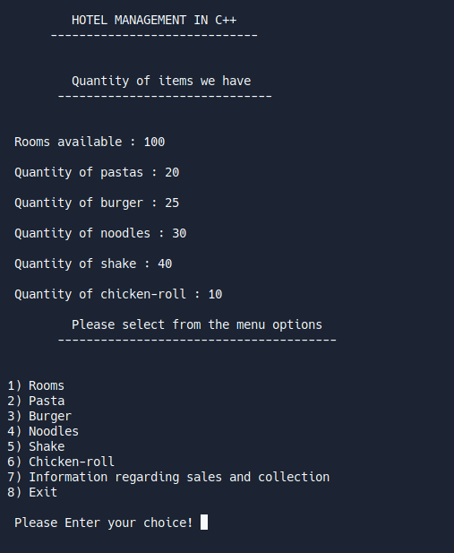
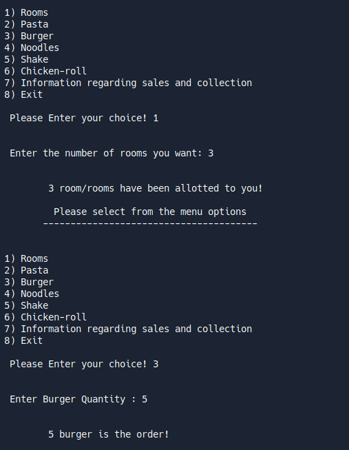

# Hotel Management in C++
### A basic c++ program to get records of hotel rooms and food items.
## I have learnt :
1. switch case
2. goto.
3. A good practices of basics of c++

>Here are Some Images ::

